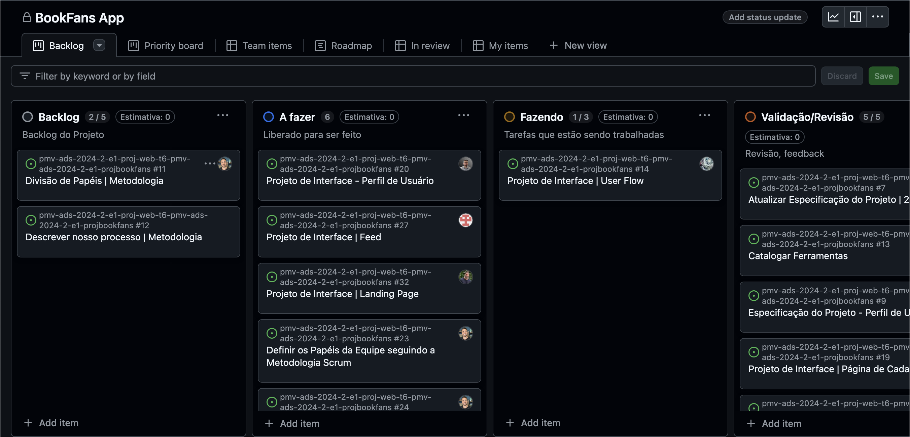
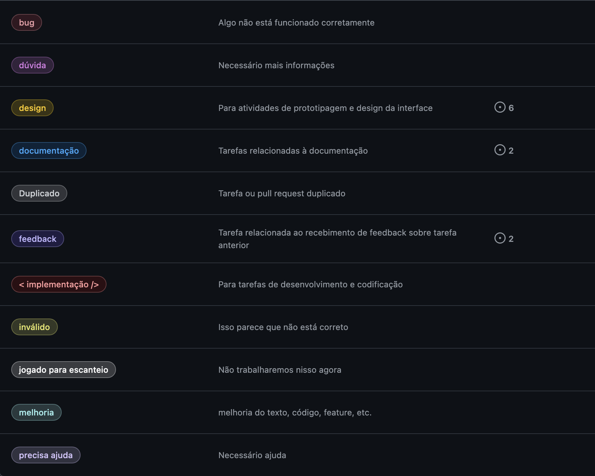

# Metodologia

### Justificativa para a Utilização do Scrum no Projeto

Dada a natureza do projeto e as circunstâncias da equipe, o **Scrum** foi escolhido como metodologia para conduzir o desenvolvimento, proporcionando a flexibilidade e a adaptabilidade necessárias para lidar com as incertezas inerentes ao trabalho proposto.

### Necessidade de Adaptabilidade

A equipe possui conhecimento limitado sobre os requisitos e as tecnologias que serão empregadas ao longo do desenvolvimento do projeto. Nesse contexto, torna-se essencial adotar uma abordagem que permita adaptações contínuas, tanto no processo quanto no produto final. O Scrum oferece ciclos curtos de desenvolvimento (sprints) e revisões frequentes, possibilitando ajustes conforme o aprendizado e os desafios técnicos emergem.

### Comunicação e Interatividade

O ambiente de trabalho remoto e o uso de múltiplas ferramentas e tecnologias exigem uma metodologia que favoreça uma comunicação constante e eficiente entre os membros da equipe. O Scrum facilita essa interatividade por meio de reuniões regulares, como dailies e revisões de sprint, garantindo que todos os participantes estejam cientes do progresso, das dificuldades e das prioridades, promovendo uma colaboração eficaz, mesmo em ambientes de ensino a distância (EAD).

### Integração em Ambiente de Ensino a Distância

O projeto está sendo desenvolvido em um formato de ensino a distância, o que demanda uma metodologia que assegure a integração e a colaboração dos membros da equipe. O Scrum, com suas cerimônias bem definidas, permite que a equipe se conecte regularmente, mantendo um alinhamento constante em relação aos objetivos do projeto. Isso evita possíveis desconexões entre os membros e garante um acompanhamento próximo das entregas.

### Complexidade e Falta de Clareza Inicial

O projeto apresenta um nível de complexidade elevado, em parte devido à falta de clareza inicial dos requisitos e das tecnologias a serem utilizadas. O Scrum possibilita a gestão dessa complexidade, dividindo o desenvolvimento em sprints e permitindo que o progresso seja avaliado continuamente. Dessa forma, a equipe consegue ajustar suas prioridades e abordar os desafios de maneira organizada e eficiente, mitigando os riscos associados à incerteza.

Diante desses fatores, a escolha do **Scrum** como metodologia se justifica pela sua capacidade de oferecer uma estrutura adaptável, promover a comunicação contínua e auxiliar no gerenciamento da complexidade do projeto, aspectos que são fundamentais para o sucesso no desenvolvimento de projetos acadêmicos em ambientes EAD.

### Divisão de Papéis [ a fazer ]

A equipe utiliza o Scrum como base para definição do processo de desenvolvimento.

#### Scrum Master:
Leopoldo Pereira da Fonseca

#### Product Owner:
Aécio Ribeiro Dantas Neto

#### Equipe de Desenvolvimento:
Aécio Ribeiro Dantas Neto 
 Guilherme Vinicius Costa Damas
 Matheus Henrique Okamoto Castiglieri
 Leopoldo Pereira da Fonseca
 Paulo Henrique Barbosa Lopes
 Renato Henrique Santiago Marcal

#### Equipe de Design: 
Aécio Ribeiro Dantas Neto
 Guilherme Vinicius Costa Damas
 Matheus Henrique Okamoto Castiglieri
 Leopoldo Pereira da Fonseca
 Paulo Henrique Barbosa Lopes
 Renato Henrique Santiago Marcal

<!-- > **Links Úteis**:
>
> - [11 Passos Essenciais para Implantar Scrum no seu
>   Projeto](https://mindmaster.com.br/scrum-11-passos/)
> - [Scrum em 9 minutos](https://www.youtube.com/watch?v=XfvQWnRgxG0) -->

### Processo

A equipe adotou o Scrum como metodologia para organizar o desenvolvimento do projeto, utilizando o GitHub Projects para acompanhar o andamento das tarefas e o status de desenvolvimento da solução. No nosso processo, as tarefas são representadas como issues, que são registradas e monitoradas diretamente no repositório do GitHub. Cada milestone é associado à entrega de uma etapa do projeto, garantindo o foco nos objetivos estabelecidos para o semestre.

As sprints são ajustadas de acordo com as unidades do semestre, refletindo o ritmo de trabalho acadêmico e as entregas previstas ao longo do semestre. Isso permite à equipe planejar e executar as tarefas dentro de períodos bem definidos, mantendo o alinhamento com o cronograma das aulas e as metas do projeto.

A comunicação entre os membros da equipe acontece principalmente através de comentários nas próprias issues, o que garante que todas as discussões, dúvidas e decisões fiquem centralizadas em um único canal. Essa prática facilita a colaboração e mantém todos os membros informados sobre o progresso e as resoluções em tempo real.

O quadro Kanban, utilizado para acompanhar o fluxo de trabalho, está estruturado da seguinte forma:

- Backlog: Todas as entregas a serem trabalhadas são listadas nesta coluna, representando o Product Backlog. Esta coluna reúne todas as atividades identificadas ao longo do projeto que ainda não foram catalogadas como tarefas para a sprint.
- A fazer: esta coluna representa o Sprint Backlog. As issues aqui são aquelas que foram priorizadas para a sprint atual, sendo retiradas do Backlog e preparadas para execução.
- Fazendo: Quando uma issue é iniciada, ela é movida para a coluna Fazendo. Aqui, a equipe está trabalhando na implementação ou execução da tarefa.
- Validação/Revisão: Após a conclusão de uma tarefa, ela é movida para esta coluna. Nesta etapa, as tarefas passam por testes e controle de qualidade para assegurar que atendem aos requisitos antes de serem oficialmente finalizadas.
- Feito: As tarefas que passaram por todos os testes e revisões são movidas para a coluna Feito. Nesta fase, as issues estão prontas para entrega, sem necessidade de edições adicionais.

Com essa abordagem, a equipe garante uma visão clara do progresso e facilita a colaboração, mantendo a comunicação centralizada nas issues e ajustando as entregas conforme as unidades do semestre.
 

<figure>
  Figura 1 - Tela do Kanban do projeto</figcaption>
</figure> 

<!-- > **Links Úteis**:
>
> - [Project management, made simple](https://github.com/features/project-management/)
> - [Sobre quadros de projeto](https://docs.github.com/pt/github/managing-your-work-on-github/about-project-boards)
> - [Como criar Backlogs no Github](https://www.youtube.com/watch?v=RXEy6CFu9Hk)
> - [Tutorial Slack](https://slack.com/intl/en-br/) -->

### Etiquetas

As tarefas podem ser etiquetadas em função da natureza da atividade e seguem o seguinte esquema de cores/categorias:

- implementacao: Tarefa relacionada à implementação/codificação de uma funcionalidade ou recurso novo no projeto.
- duplicado: Indica que a issue foi marcada como duplicata de outra já existente, consolidando o trabalho em um único lugar.
- dúvida: Utilizada para questões ou pedidos de esclarecimento que surgem durante o projeto e precisam de respostas.
- bug: Marca problemas ou falhas no código que devem ser resolvidos para garantir o funcionamento correto do sistema.
- design: Relacionada a tarefas que envolvem o design visual ou de interface da aplicação, como protótipos e layouts.
- documentação: Aplicada a issues que requerem a criação, revisão ou atualização da documentação do projeto.
- feedback: Usada para marcar tarefas relacionadas ao recebimento e análise de feedback dos usuários ou de revisões da equipe.
- inválido: Esta etiqueta é usada para marcar issues que foram abertas, mas que não são mais relevantes ou foram identificadas como inválidas.
- jogado para escanteio: Indica que a tarefa ou issue foi adiada ou não será mais tratada no momento.
- melhoria: Relacionada a melhorias e otimizações no código ou na funcionalidade existente, sem que seja uma nova implementação.
- precisa ajuda: Indica que a tarefa precisa de assistência de outros membros da equipe ou que a pessoa responsável encontrou dificuldades.

 

<figure> 
  Figura 2 - Tela do esquema de cores e categorias</figcaption>
</figure> 
  
### Ferramentas

Os artefatos do projeto são desenvolvidos a partir de diversas plataformas e a relação dos ambientes com seu respectivo propósito é apresentada na tabela que se segue.

| AMBIENTE                    | PLATAFORMA      | LINK DE ACESSO                                                                                                                |
| --------------------------- | --------------- | ----------------------------------------------------------------------------------------------------------------------------- |
| Repositório de código fonte | GitHub          | https://github.com/ICEI-PUC-Minas-PMV-ADS/pmv-ads-2024-2-e1-proj-web-t6-pmv-ads-2024-2-e1-projbookfans/tree/main/codigo-fonte |
| Documentos do projeto       | GitHub          | https://github.com/ICEI-PUC-Minas-PMV-ADS/pmv-ads-2024-2-e1-proj-web-t6-pmv-ads-2024-2-e1-projbookfans/tree/main/documentos   |
| Projeto de Interface        | Moqups          | https://app.moqups.com/StdPw80wj2EsmrsnW36NKpwgEc2IXGt0/view/page/a4d3e578f                                                   |
| Projeto de Interface        | Figma          | n/a  
| Gerenciamento do Projeto    | GitHub Projects | https://github.com/orgs/ICEI-PUC-Minas-PMV-ADS/projects/1329                                                                  |
| Hospedagem                  | GitHub Pages    | https://icei-puc-minas-pmv-ads.github.io/pmv-ads-2024-2-e1-proj-web-t6-pmv-ads-2024-2-e1-projbookfans/codigo-fonte/src/       |

### Estratégia de Organização de Codificação

Todos os artefatos relacionados a implementação e visualização dos conteúdos do projeto se encontram no repositório oficial do projeto [BookFans App - Repositório](https://github.com/ICEI-PUC-Minas-PMV-ADS/pmv-ads-2024-2-e1-proj-web-t6-pmv-ads-2024-2-e1-projbookfans).
