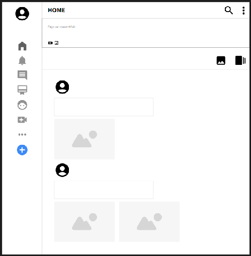
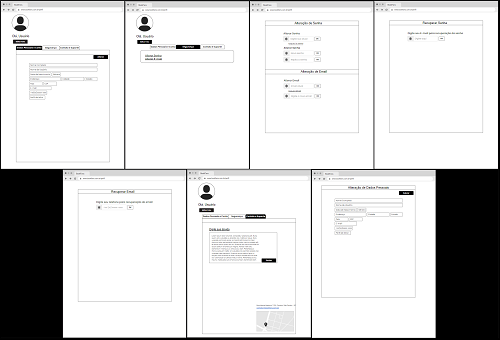

# Projeto de Interface

## User Flow

O diagrama na Figura 1 ilustra o caminho que o usuário percorre ao navegar pelas telas do sistema. Cada uma dessas telas é descrita em detalhe na seção dedicada ao Protótipo de baixa fidelidade. Para conferir o protótipo interativo, acesse o link <a href="https://marvelapp.com/prototype/10ic6h00/screen/95585116"> ambiente MarvelApp do projeto</a>.

Figura 1 - Fluxo de telas do usuário.

## Protótipo

Desenvolver um protótipo emerge como uma das maneiras mais ágeis e econômicas de validar uma ideia, conceito ou funcionalidade. Isso permite a interação, avaliação, modificação e aprovação das principais características de uma interface antes de entrar na fase de desenvolvimento. Leia o artigo [Protótipos: baixa, média ou alta fidelidade?](https://medium.com/ladies-that-ux-br/prot%C3%B3tipos-baixa-m%C3%A9dia-ou-alta-fidelidade-71d897559135).

### Protótipo de baixa fidelidade

Protótipos de baixa fidelidade apresentam de forma simplificada o design da interface e o relacionamento entre suas páginas, permitindo evolução da proposta da solução. Neste projeto, os utilizaremos para apoiar a validação dos requisitos e efetuar mudanças dos mesmos, caso seja necessário, para menor impacto na codificação da aplicação.

### Tela - Home page

A tela de home page apresenta o projeto e ilustra as principais atividades que a plataforma oferece por meio de banners, imagens e vídeos. Há também um destaque para o campo de busca, permitindo ao visitante encontrar facilmente a informação desejada.

 

Figura 2 - Home page pública.

### Telas - Criação de conta em desktop

Apresentam campos para a realização do primeiro cadastro de senha, cadastro facilitado via login com 'Google', declaração de desejo de receber mensagens com notícias, além de confirmação de definição de senha via código enviado para o e-mail do usuário.

 

Figura 3 - Criação de conta - desktop.

### Telas - Criação de conta em dispositivo móvel

Ambientes que apresentam as mesmas funcionalidades do perfil 'Desktop' mas, desta vez, em layout adaptado com responsividade para dispositivos móveis.

 

Figura 4 - Criação de conta - dispositivo móvel.

### Telas - Login

Telas que apresentam campos para digitação de login e senha responsivas para ambientes desktop e dispositivos móveis. Ao usuário também é apresentada a possibilidade de criação de nova conta ou redefinição de sua senha.

 

Figura 5 - Telas de acesso à conta do usuário.

### Tela - Feed

Tela principal para navegação no programa, onde ícones na lateral esquerda apresentam as funcionalidades disponiveis e, ao centro, as informações são exibidas em formado de feed.

 

Figura 6 - Tela de navegação principal.

### Telas - Perfil

As telas apresentam funcionalidades de atualização cadastral, upload ou mudança de foto do usuário, funções importantes de segurança tais como alteração ou recuperação de senha ou e-mail de registro, além de confirmação de identidade em duas etapas. Também há a opção de envio de mensagens ao suporte do programa na aba 'Contato e suporte'.

 

Figura 7 - Perfil de usuário.