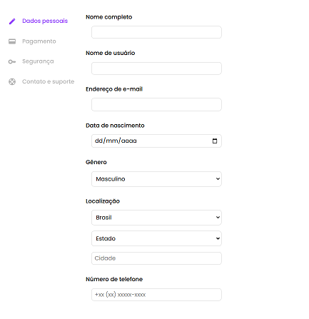

# Programação de Funcionalidades

Pré-requisitos: <a href="https://github.com/ICEI-PUC-Minas-PMV-ADS/pmv-ads-2024-2-e1-proj-web-t6-pmv-ads-2024-2-e1-projbookfans/blob/7761efdcdb9691fd3b169fb4e37b6c5b95ebcf80/documentos/02-Especifica%C3%A7%C3%A3o%20do%20Projeto.md"> Especificação do Projeto: </a>, <a href="https://github.com/ICEI-PUC-Minas-PMV-ADS/pmv-ads-2024-2-e1-proj-web-t6-pmv-ads-2024-2-e1-projbookfans/blob/7761efdcdb9691fd3b169fb4e37b6c5b95ebcf80/documentos/03-Metodologia.md"> Metodologia</a>, <a href="https://github.com/ICEI-PUC-Minas-PMV-ADS/pmv-ads-2024-2-e1-proj-web-t6-pmv-ads-2024-2-e1-projbookfans/blob/7761efdcdb9691fd3b169fb4e37b6c5b95ebcf80/documentos/04-Projeto%20de%20Interface.md"> Projeto de Interface</a>, <a href="https://github.com/ICEI-PUC-Minas-PMV-ADS/pmv-ads-2024-2-e1-proj-web-t6-pmv-ads-2024-2-e1-projbookfans/blob/7761efdcdb9691fd3b169fb4e37b6c5b95ebcf80/documentos/05-Template%20padr%C3%A3o%20da%20Aplica%C3%A7%C3%A3o.md"> Template padrão da Aplicação</a>

### Tela de Feed (RF-001)

Responsável: Renato

O acesso a tela de cadastro poderá ser feito através da opção de menu “Alterar Perfil”, na tela de "Perfil do Usuário". As estruturas de dados foram baseadas em HTML e CSS.

Exemplo da tela de cadastro: 

#### Requisito atendido

RF-001: O sistema deve permitir a manutenção de textos por autores, incluindo título, resumo, conteúdo e privacidade (privado/rascunho, não listado, apenas para assinantes, público).

#### Artefatos da funcionalidade

●cadastre-se.html

●cadastro.css

●script.js

●mobile-navbar.js

#### Instruções de acesso

Abra um navegador de Internet e informe a seguinte URL: https://icei-puc-minas-pmv-ads.github.io/pmv-ads-2022-1-e1-proj-web-t3-vida-de-estudante/src/paginaHome/index.html

Ao clicar em “Cadastre-se” no canto superior direito da tela, terá acesso a página de cadastro.

### Tela de Login (RF-002)

### Login

[Adicione imagem da funcionalidade/tela]

#### Requisito atendido

[RF-X: adicione a descrição do requisito atendido]

### Registro

[Adicione imagem da funcionalidade/tela]

#### Requisito atendido

[RF-X: adicione a descrição do requisito atendido]

### Editar Perfil

[Adicione imagem da funcionalidade/tela]

#### Requisito atendido

[RF-X: adicione a descrição do requisito atendido]

### Feed

[Adicione imagem da funcionalidade/tela]

#### Requisito atendido

[RF-X: adicione a descrição do requisito atendido]

### Recuperar Senha

[Adicione imagem da funcionalidade/tela]

#### Requisito atendido

[RF-X: adicione a descrição do requisito atendido]

### Suporte

[Adicione imagem da funcionalidade/tela]

#### Requisito atendido

[RF-X: adicione a descrição do requisito atendido]

### Termos de Uso

[Adicione imagem da funcionalidade/tela]

#### Requisito atendido

[RF-X: adicione a descrição do requisito atendido]

#### Artefatos da funcionalidade

Arquivos tela home: home.html, home.css
Arquivos tela Perfil: index.html, index.css, reset.css
Arquivos tela home: home.html, home.css
Arquivos tela home: home.html, home.css
Arquivos tela home: home.html, home.css
Arquivos tela home: home.html, home.css
Arquivos tela home: home.html, home.css
Arquivos tela home: home.html, home.css

#### Estrutura de Dados

[Caso exista estrutura de dados, adicione aqui]

#### Instruções de acesso

[Adicione as orientações de acesso à funcionalidade]

#### Responsável

[Adicione nome do responsável pelo desenvolvimento da funcionalidade]

### Título da funcionalidade

Avaliação de texto

#### Requisito atendido

RF-04 - O sistema deve permitir avaliações de leitores em um texto, de 1 a 5 estrelas

#### Artefatos da funcionalidade

- [`codigo-fonte/src/components/star-rating.html`](https://github.com/ICEI-PUC-Minas-PMV-ADS/pmv-ads-2024-2-e1-proj-web-t6-pmv-ads-2024-2-e1-projbookfans/blob/main/codigo-fonte/src/components/star-rating.html)
- [`codigo-fonte/src/assets/js/main.js`](https://github.com/ICEI-PUC-Minas-PMV-ADS/pmv-ads-2024-2-e1-proj-web-t6-pmv-ads-2024-2-e1-projbookfans/blob/main/codigo-fonte/src/assets/js/main.js)

#### Estrutura de Dados

Array

#### Instruções de acesso

Navegar à pagina de texto, localizada em [`codigo-fonte/src/paginaVerTexto/index.html`](https://icei-puc-minas-pmv-ads.github.io/pmv-ads-2024-2-e1-proj-web-t6-pmv-ads-2024-2-e1-projbookfans/codigo-fonte/src/paginaVerTexto/index.html).

#### Responsável

Aécio Ribeiro Dantas Neto

> **Links Úteis**:
> - [Trabalhando com HTML5 Local Storage e JSON](https://www.devmedia.com.br/trabalhando-com-html5-local-storage-e-json/29045)
> - [JSON Tutorial](https://www.w3resource.com/JSON)
> - [JSON - Introduction (W3Schools)](https://www.w3schools.com/js/js_json_intro.asp)
> - [JSON Tutorial (TutorialsPoint)](https://www.tutorialspoint.com/json/index.htm)

