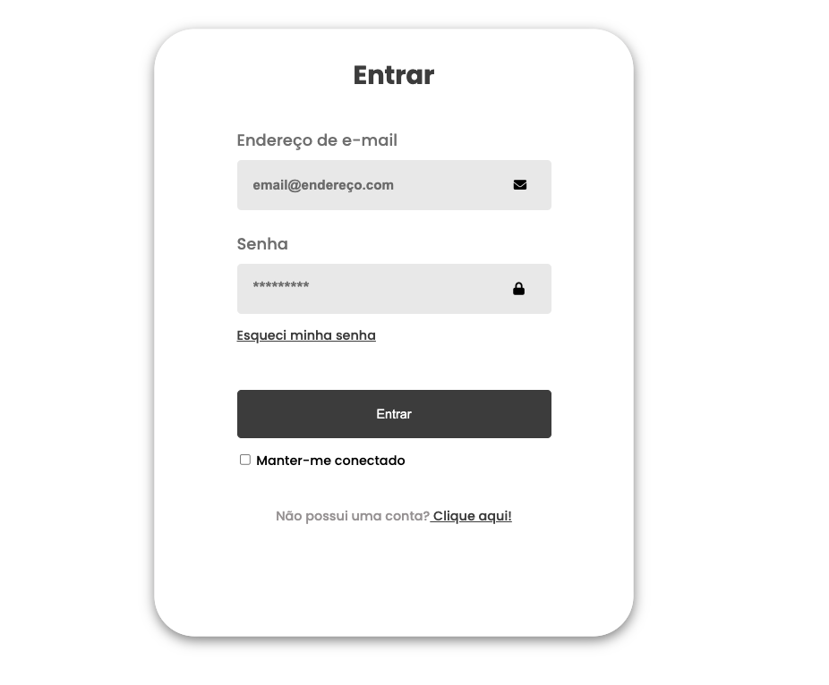
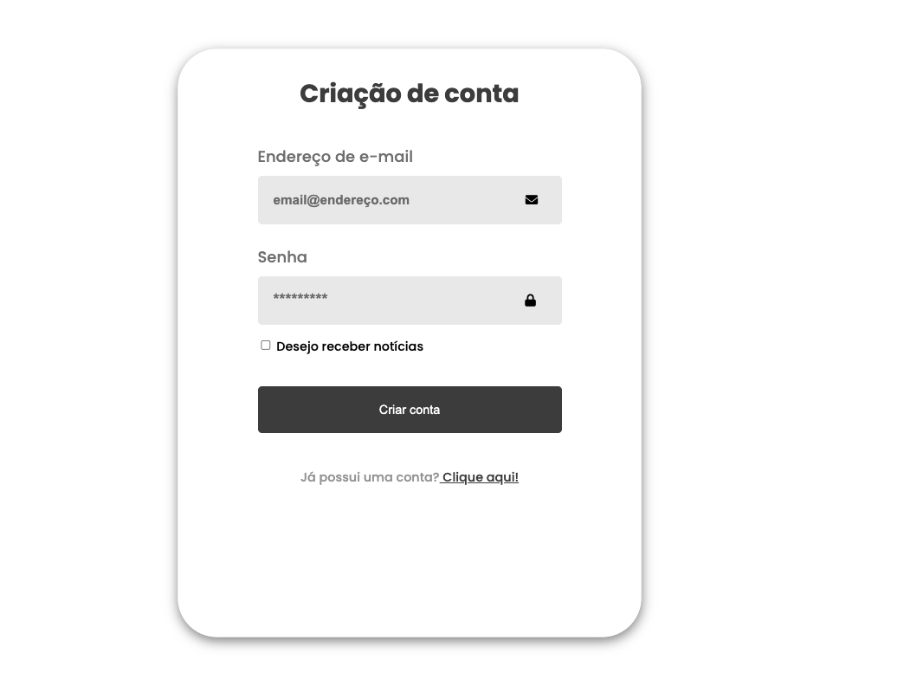
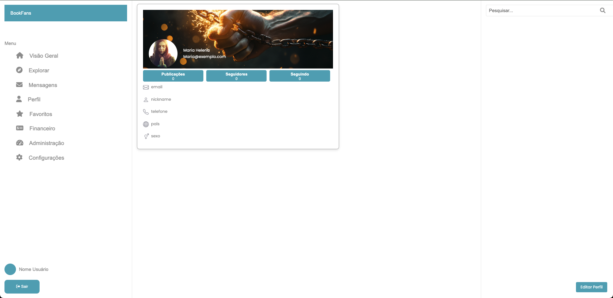
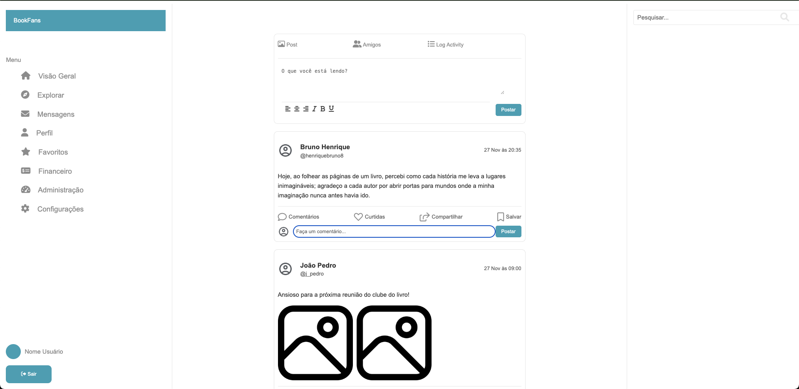
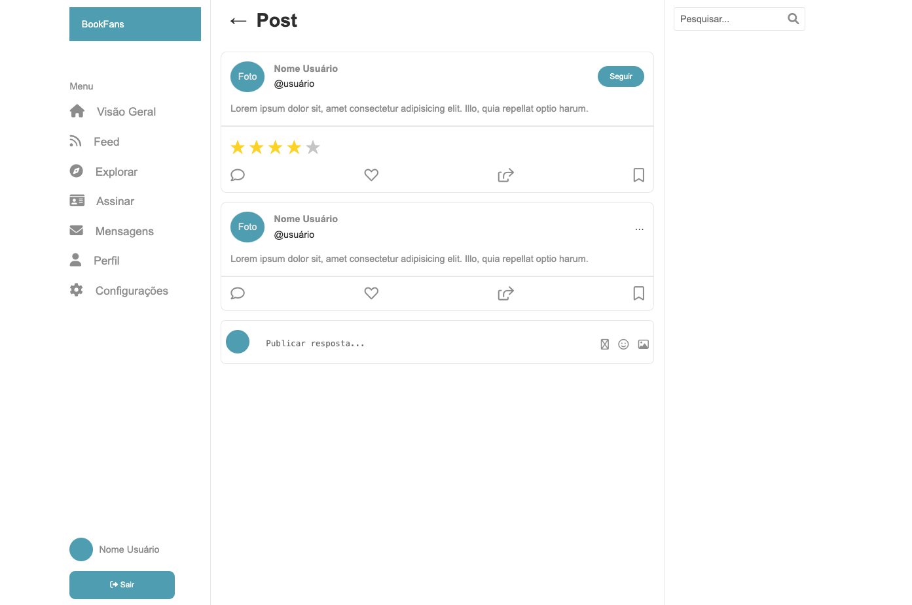

# Programação de Funcionalidades

Pré-requisitos: <a href="https://github.com/ICEI-PUC-Minas-PMV-ADS/pmv-ads-2024-2-e1-proj-web-t6-pmv-ads-2024-2-e1-projbookfans/blob/7761efdcdb9691fd3b169fb4e37b6c5b95ebcf80/documentos/02-Especifica%C3%A7%C3%A3o%20do%20Projeto.md"> Especificação do Projeto: </a>, <a href="https://github.com/ICEI-PUC-Minas-PMV-ADS/pmv-ads-2024-2-e1-proj-web-t6-pmv-ads-2024-2-e1-projbookfans/blob/7761efdcdb9691fd3b169fb4e37b6c5b95ebcf80/documentos/03-Metodologia.md"> Metodologia</a>, <a href="https://github.com/ICEI-PUC-Minas-PMV-ADS/pmv-ads-2024-2-e1-proj-web-t6-pmv-ads-2024-2-e1-projbookfans/blob/7761efdcdb9691fd3b169fb4e37b6c5b95ebcf80/documentos/04-Projeto%20de%20Interface.md"> Projeto de Interface</a>, <a href="https://github.com/ICEI-PUC-Minas-PMV-ADS/pmv-ads-2024-2-e1-proj-web-t6-pmv-ads-2024-2-e1-projbookfans/blob/7761efdcdb9691fd3b169fb4e37b6c5b95ebcf80/documentos/05-Template%20padr%C3%A3o%20da%20Aplica%C3%A7%C3%A3o.md"> Template padrão da Aplicação</a>

<!-- # Estrutura das Funcionalidades

### Funcionalidade
Responsável:
#### Descrição
Descrição
#### Requisito atendido
RF-
#### Artefatos da funcionalidade
caminho/arquivos/etc
#### Estrutura de Dados
#### Instrução de acesso

 -->

### Tela de Login

Responsável: Guilherme

O acesso a tela de login poderá ser feito através da opção de menu “Login”, na tela de "Home". As estruturas de dados foram baseadas em HTML e CSS.

#### Requisito atendido

RF-21: O sistema deve permitir que usuários façam login para acessar funcionalidades restritas.

### Registro

#### Requisito atendido

RF-20 O sistema deve permitir que novos usuários se cadastrem por meio de uma página de cadastro. 

### Editar Perfil

Responsável: Paulo

Permite ao usuário da aplicação acessar e editar configurações pessoais (nome, email, etc). As estruturas de dados foram baseadas em HTML e CSS.

#### Requisito atendido

RF-25: O sistema deve oferecer uma área de edição de perfil para que usuários alterem informações pessoais, como nome, e-mail e foto de perfil

### Feed

Responsável: Renato

#### Requisito atendido 
RF-02	O sistema deve permitir a busca por textos e grupos de texto, oferecendo filtros para tipo de texto, título, autor, data de publicação, data de última atualização, categoria, gênero, número de palavras, status de conclusão (em progresso, concluído, abandonado) e tags.
RF-06	O sistema deve oferecer uma interface de edição de texto para autores, com ferramentas de formatação.
RF-16	O sistema deve gerar um feed para cada leitor, mostrando atualizações e publicações recentes de autores e recomendações de textos e autores que possam o interessar

### Ver Texto

Permite ao usuário interagir com textos - curtir, compartilhar, avaliar, comentar. 
Responsável: Aécio

#### Requisito atendido
RF-03	O sistema deve permitir comentários de leitores em um texto.
RF-04	O sistema deve permitir avaliações de leitores em um texto, de 1 a 5 estrelas.

<!-- ### Recuperar Senha

[Adicione imagem da funcionalidade/tela]

#### Requisito atendido

[RF-X: adicione a descrição do requisito atendido]

### Suporte

[Adicione imagem da funcionalidade/tela]

#### Requisito atendido

[RF-X: adicione a descrição do requisito atendido]

### Termos de Uso

[Adicione imagem da funcionalidade/tela]

#### Requisito atendido

[RF-X: adicione a descrição do requisito atendido] -->

<!-- ## Template para preenchimento

### Título da funcionalidade

Avaliação de texto

#### Requisito atendido

RF-04 - O sistema deve permitir avaliações de leitores em um texto, de 1 a 5 estrelas

#### Artefatos da funcionalidade

- [`codigo-fonte/src/components/star-rating.html`](https://github.com/ICEI-PUC-Minas-PMV-ADS/pmv-ads-2024-2-e1-proj-web-t6-pmv-ads-2024-2-e1-projbookfans/blob/main/codigo-fonte/src/components/star-rating.html)
- [`codigo-fonte/src/assets/js/main.js`](https://github.com/ICEI-PUC-Minas-PMV-ADS/pmv-ads-2024-2-e1-proj-web-t6-pmv-ads-2024-2-e1-projbookfans/blob/main/codigo-fonte/src/assets/js/main.js)

#### Estrutura de Dados

Array

#### Instruções de acesso

Navegar à pagina de texto, localizada em [`codigo-fonte/src/paginaVerTexto/index.html`](https://icei-puc-minas-pmv-ads.github.io/pmv-ads-2024-2-e1-proj-web-t6-pmv-ads-2024-2-e1-projbookfans/codigo-fonte/src/paginaVerTexto/index.html).

#### Responsável

Aécio Ribeiro Dantas Neto -->

> **Links Úteis**:
> - [Trabalhando com HTML5 Local Storage e JSON](https://www.devmedia.com.br/trabalhando-com-html5-local-storage-e-json/29045)
> - [JSON Tutorial](https://www.w3resource.com/JSON)
> - [JSON - Introduction (W3Schools)](https://www.w3schools.com/js/js_json_intro.asp)
> - [JSON Tutorial (TutorialsPoint)](https://www.tutorialspoint.com/json/index.htm)

